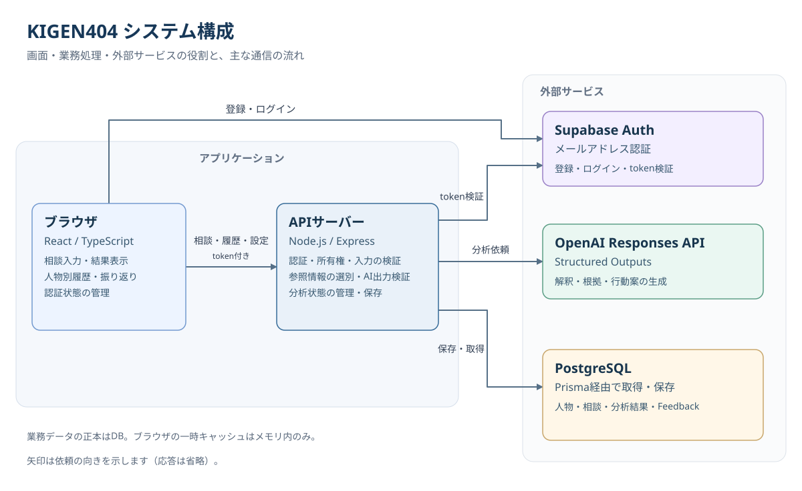

# KIGEN404

**人間関係の「気になる」を、根拠・別の見方・次の行動に整理するWebアプリ。**

返信がいつもより短い、会話のあとに相手の反応が気になる。そんなときに、出来事や相手の反応、自分の対応を入力し、AIで状況を整理できます。
分析結果には、気になる材料だけでなく、心配を弱める材料や分からないことも表示します。複数の見方を確認し、自分で次の対応を選ぶための判断材料を提供します。

AIの出力は入力内容に基づく解釈であり、相手の本心の断定や心理診断ではありません。

## どんな場面で使うのか

例えば、次のような相談を整理することを想定しています。

> 友人に予定を聞いたら、いつもより短い返信が来た。
> 自分の言い方が悪かったのか、相手が忙しいだけなのか気になっている。

KIGEN404では、出来事、相手の反応、自分の対応、相手との関係性を入力します。
結果画面で「何が心配の根拠になっているか」「ほかにどんな解釈があるか」、連絡のタイミングを確認し、行動提案画面で次の対応や返信例を参考にできます。

上の相談は利用イメージを示す架空の例です。AIの回答内容は入力や参照情報によって変わります。

## 使い方

1. **登録・ログインする** — メールアドレスとパスワードで利用を開始します。
2. **相談を入力する** — 相手の名前・関係性、出来事、相手の反応、自分の対応などを入力します。過去に相談した相手も選べます。
3. **分析結果を確認する** — 状況の要約、6つのスコア、根拠、不明点、別の解釈、連絡タイミングを確認します。
4. **次の行動を考える** — 推奨行動、避けたい行動、返信例を参考にします。
5. **振り返りを残す** — 分析が役立ったか、読みすぎだと感じたか、その後どうなったかを記録できます。

相談と分析結果は人物ごとの履歴に保存され、あとから見返せます。

## 主な機能

| 機能 | できること |
| --- | --- |
| 相談入力 | 出来事、関係性、反応、自分の対応を整理して入力。会話を自分・相手の発言に分けて入力することも可能 |
| 人物情報の再利用 | 過去に相談した相手を選び、名前・関係性を再利用。保存済みの名前・関係性は明示的に編集・保存 |
| AI分析 | 要約、スコア、心配材料、心配を弱める材料、不明点、別の解釈、連絡タイミングを表示 |
| 行動提案 | 推奨行動、避ける行動、理由、返信例を表示 |
| 人物別の履歴 | 過去の相談や保存済みの分析結果を再表示 |
| 振り返り（Feedback） | 役立った度合い、読みすぎだと感じた度合い、その後のメモを保存・編集 |
| パーソナライズ設定 | 過去情報を次の分析に使うか、振り返りを参照してよいかを選択 |

### 過去の相談をどう使うか

パーソナライズを有効にすると、**同じユーザー・同じ人物**の過去情報を分析の参考にできます。

- 過去の分析済み相談から、直近最大3件の結果要約を参照します。
- 振り返りは、設定と各Feedbackの両方で利用を許可したものだけを、直近最大3件参照します。
- 比較の根拠が不足している場合は、十分な情報がないことを示し、今回の入力を中心に整理します。
- パーソナライズを無効にすると、今回の入力内容だけを使います。

利用許可はあとから変更できます。ただし、利用をOFFにする操作は保存済みデータの削除ではありません。
人物ごとの傾向要約（PersonProfile）を自動生成する処理は未実装です。現在の主な参照情報は、過去相談の要約と許可されたFeedbackです。

## 分析結果の読み方

6つのスコアは「怒り気味」「冷たい」「距離あり」「忙しい」「淡々」「大丈夫」です。
各スコアは入力から見える判断材料の相対的な強さを示し、**相手がその感情を持っている確率ではありません**。

- **根拠と不確実性** — 心配材料、心配を弱める材料、分からないことを分けて表示します。
- **別の解釈** — 一つの受け取り方に加えて、ほかの可能性と理由を確認できます。
- **確信度** — AI自身の評価です。実測した正解率ではありません。
- **普段との比較** — 許可された過去情報を実際に参照し、比較の根拠がある場合に表示します。

結果画面は要約から読み始め、入力内容、各スコアの根拠、比較の詳細を必要に応じて開ける構成です。

## システム構成



ブラウザは相談の入力と結果表示を担当し、APIが認証・所有権の確認、AIへの依頼、データ保存を担当します。
ログインはブラウザからSupabase Authへ直接行い、APIは受け取ったtokenでユーザーを確認します。

[draw.ioで編集できる構成図](docs/diagrams/system-architecture.drawio)も用意しています。

| 分類 | 使用技術 |
| --- | --- |
| フロントエンド | React 18、TypeScript、Vite 6、React Router 7、Tailwind CSS 4、Recharts、Lucide React |
| バックエンド | Node.js、Express 4、TypeScript、tsx |
| 認証 | Supabase Auth |
| データベース | PostgreSQL、Prisma 7、`@prisma/adapter-pg` |
| AI | OpenAI Responses API、Structured Outputs、Zod |
| テスト | Node.js test runner、tsx |
| 開発環境 | Docker、Docker Compose |

AIモデルは環境変数で指定します。コードに固定の既定モデルはありません。

### 技術スタックの採用理由

相談を入力し、結果を確認し、あとから履歴や振り返りを扱う流れに合わせて、各技術の役割を分けています。
以下では、各技術を現在の構成で使う理由をまとめています。

| 技術 | KIGEN404で使う理由 |
| --- | --- |
| React | 入力フォーム、分析結果、履歴などをコンポーネントに分け、共通UIを再利用しながら入力・保存・読み込み状態を扱うため |
| TypeScript | 相談データや分析結果の形をコード上で定義し、API呼び出しや表示処理の型の不一致を開発時に見つけるため。外部入力は別途Zodで検証 |
| Vite | フロントエンドの開発サーバーとbuildを担当させ、画面の変更を確認しながら開発するため |
| React Router | 相談・分析・行動提案・履歴をURLで分け、画面遷移とログインが必要な画面への入口を管理するため |
| Tailwind CSS | 画面の余白・色・レスポンシブ表示をクラスで指定し、共通の見た目を保ちながらUIを調整するため |
| Recharts | 6つのスコアをグラフで表示し、根拠の文章と合わせて結果を確認できるようにするため |
| Lucide React | ナビゲーションや行動案などのアイコンを共通の見た目で表示するため |
| Node.js / Express | フロントと同じTypeScriptでAPIを実装し、認証・入力検証・業務処理・エラー処理を組み合わせるため |
| Supabase Auth | 登録・ログイン・token発行を認証基盤に任せ、アプリ独自のパスワード管理やJWT発行処理を持たないため |
| PostgreSQL | 人物・相談・分析結果・Feedbackの関係を保存し、制約やトランザクションで所有関係と更新の整合性を保つため |
| Prisma | DBモデルに沿った型付きの取得・保存処理を記述するため。RLSなどPostgreSQL固有の設定はSQL migrationで管理 |
| OpenAI Responses API / Structured Outputs | 関係性や出来事を踏まえた解釈・根拠・行動案を生成し、結果画面で扱う項目を定義した構造で受け取るため |
| Zod | API入力とAI出力の形式・値を実行時に検証し、不正なデータをそのまま保存・表示しないため |
| Node.js test runner / tsx | TypeScriptで書いたテストを実行し、認証境界・分析状態・表示変換などの仕様を継続して確認するため |
| Docker / Docker Compose | フロントエンドとAPIの実行環境・起動方法を揃え、開発環境を再現しやすくするため |

### 実装で大切にしていること

| 目的 | 実装上の工夫 |
| --- | --- |
| 自分の相談だけを扱う | サーバーで認証したユーザーIDを使い、DBの取得・更新条件にも所有者を含める |
| 相談をあとから見返す | 相談と結果をDBに保存。ブラウザの一時キャッシュはメモリ内に限定し、業務データを`localStorage`へ保存しない |
| 分析結果の取り違えを防ぐ | 分析ごとの`analyze_run_id`を照合し、古い非同期応答による上書きを防ぐ。最新結果は`version`で判定 |
| AI出力を確認してから表示する | Structured Outputsで形式を指定し、Zodによる構造検証と禁止表現・参照元の検証を行う |
| 参照した情報を追えるようにする | 分析に使った過去相談・FeedbackのIDと参照情報の記録を結果とともに保存 |

これらの検証は、AIの解釈が常に正しいことや、すべての不適切な出力を防げることを保証するものではありません。

## 現在の制約

- 人物ごとの傾向要約（PersonProfile）の自動生成・再生成は未実装です。条件を満たす保存済みProfileを参照する処理はあります。
- ユーザー全体の傾向要約（UserPatternSummary）は、保存済みデータの取得・削除APIのみです。生成処理はなく、現在のAI分析にも渡しません。
- ログイン状態をブラウザへ永続保存しないため、再読込や期限切れ後に再ログインが必要になる場合があります。
- パスワード再設定、ログイン不要のゲスト分析、汎用の設定画面は未提供です。パーソナライズはプライバシー設定画面で変更できます。
- 分析処理が長時間止まった場合の回復処理は、APIや定期実行へ接続していません。本番の回復条件・運用方法は未決定です。
- 本番モードのAI分析には、有効な利用上限設定（RateLimitPolicy）が必要です。具体的な本番値はmigrationに含めていません。

## ローカル開発

### 必要なもの

- Node.js 22.12以降の22系とnpm（Docker環境でもNode.js 22を使用）
- Supabase Authを利用できるプロジェクト
- アプリ用のPostgreSQL接続先（migrationはSupabase管理の`auth.users`を参照します）
- OpenAI APIキーと、利用するAIモデルの設定

以下のコマンドはリポジトリ直下で実行します。Windows PowerShellで`npm`が実行ポリシーにより使えない場合は、`npm.cmd`に置き換えてください。

### 1. 依存関係をインストールする

```bash
npm ci
```

### 2. 環境変数を設定する

リポジトリ直下に`.env.local`を作成し、利用する開発環境の値を設定します。
`.env`と`.env.local`はGit管理外です。

```dotenv
VITE_SERVER_URL=http://127.0.0.1:3000
VITE_SUPABASE_URL=
VITE_SUPABASE_PUBLISHABLE_KEY=

SUPABASE_URL=
SUPABASE_PUBLISHABLE_KEY=
DATABASE_URL=
DIRECT_URL=

OPENAI_API_KEY=
OPENAI_ANALYSIS_MODEL=

PORT=3000
ALLOWED_ORIGINS=http://localhost:5173,http://127.0.0.1:5173
```

`OPENAI_ANALYSIS_MODEL`には利用可能なモデル名を設定してください。未設定時は`OPENAI_MODEL`を参照しますが、どちらもなければ分析できません。
秘密情報を`VITE_`付きの変数へ入れないでください。`VITE_`付きの値はブラウザへ配信されます。

#### 環境変数の役割・互換設定

| 変数 | 用途 | 備考 |
| --- | --- | --- |
| `VITE_SERVER_URL` | ブラウザから呼ぶAPIのURL | Vite開発時は未設定なら`http://127.0.0.1:3000` |
| `VITE_SUPABASE_URL` | フロントエンドのSupabase URL | 必須 |
| `VITE_SUPABASE_PUBLISHABLE_KEY` | フロントエンドの公開可能キー | `VITE_SUPABASE_ANON_KEY`も利用可能 |
| `SUPABASE_URL` | バックエンドのSupabase URL | 未設定時は`VITE_SUPABASE_URL`を使用 |
| `SUPABASE_PUBLISHABLE_KEY` | サーバーでtoken検証に使う公開可能キー | 未設定時は`VITE_SUPABASE_PUBLISHABLE_KEY`または`NEXT_PUBLIC_SUPABASE_ANON_KEY` |
| `DATABASE_URL` | アプリ実行時のPostgreSQL接続先 | 必須 |
| `DIRECT_URL` | Prisma CLI用の接続先 | 未設定時は`DATABASE_URL`を使用 |
| `OPENAI_API_KEY` | OpenAI APIキー | AI分析に必須 |
| `OPENAI_ANALYSIS_MODEL` | AI分析で使うモデル | 未設定時は`OPENAI_MODEL`を使用 |
| `PORT` | APIの待受ポート | 既定値は`3000` |
| `ALLOWED_ORIGINS` | CORSで許可するOrigin | カンマ区切り。`FRONTEND_ORIGIN`も利用可能 |

### 3. 開発用DBとPrisma Clientを準備する

新しい開発用DBでは、Supabase Authの準備後に既存のmigrationを適用します。
すでに準備済みの共有開発DBを使う場合は、適用状況を確認してください。

```bash
# 接続先のmigration適用状況を確認
npm run prisma:migrate:status

# 開発用DBに未適用のmigrationを適用
npm run prisma:migrate:deploy

# アプリで使用するPrisma Clientを生成
npm run prisma:generate
```

migration適用とPrisma Client生成は別の処理です。
`DATABASE_URL`・`DIRECT_URL`が、作業対象の開発用DBを指していることを確認してから実行してください。

Prisma schemaはアプリの型・モデル定義、SQL migrationはRLSやCHECK制約、trigger、indexなどのDB設定を管理します。
Supabase管理の`auth.users`を、アプリ独自のユーザーテーブルへ置き換えません。

### 4. フロントエンドとバックエンドを起動する

フロントエンド:

```bash
npm run dev
```

別のターミナルでバックエンド:

```bash
npm run server:dev
```

- アプリ: `http://localhost:5173`
- APIの起動確認: `http://localhost:3000/health`

`/health`が`{"status":"ok"}`を返せばAPIプロセスは起動しています。DB接続やAI分析の成功を確認するエンドポイントではありません。
ユーザー登録・ログインにはSupabase Authを使用します。メール確認の有無は利用するSupabase環境の設定に従います。

### Dockerで起動する場合

Docker Composeではフロントエンドとバックエンドを起動します。SupabaseとPostgreSQLは外部の接続先を使用します。
`.env.local`の設定と開発用DBの準備は必要です。Compose起動時にmigrationは自動適用されません。

```bash
# 初回起動・依存関係変更後
docker compose up --build -d

# 起動状態の確認
docker compose ps

# 停止
docker compose down
```

起動後のURLは通常のローカル開発と同じです。
ログの確認や依存関係用volumeの更新などは、[Docker開発環境セットアップ](docs/docker-development-setup.md)を参照してください。

## 開発用コマンドとテスト

| 目的 | コマンド |
| --- | --- |
| フロントエンド開発サーバー | `npm run dev` |
| バックエンド起動 | `npm run server` |
| バックエンド監視起動 | `npm run server:dev` |
| TypeScript検査 | `npm run typecheck` |
| Markdown検査 | `npm run lint:md` |
| 全テスト | `npm test` |
| フロントエンドbuild | `npm run build:client` |
| バックエンドbuild | `npm run build:server` |
| 全体build | `npm run build` |
| build済みサーバー起動 | `npm start` |
| Prisma schema検証 | `npm run prisma:validate` |
| Prisma schema整形 | `npm run prisma:format` |
| Prisma Client生成 | `npm run prisma:generate` |

`npm run lint`もTypeScript検査です。現在はESLintを実行しません。
`npm run build:server`は、Prisma Client生成後にサーバーをbuildします。

`npm test`では、`src/backend/**/*.test.ts`と`experiments/ai-evals/scripts/*.test.ts`をNode.js test runnerで実行します。
認証・所有権、分析の状態遷移と同時実行、AI出力の構造・表現・参照元の検証、画面表示用の変換、履歴取得、Feedbackや設定の保存処理などを確認します。

自動テストの成功と、実際のAIによる解釈の品質・本番環境での動作確認は別に扱います。
テスト数や処理時間などの検証記録は、対象時点・環境を確認して参照してください。

## ディレクトリ構成

```text
.
├─ public/                         # ロゴなどの静的ファイル
├─ docs/                           # 仕様、DB設計、開発手順、調査・検証記録
├─ experiments/ai-evals/            # AI評価用の実験・検証コード
├─ src/
│  ├─ app/
│  │  ├─ api/                      # APIクライアントと変換処理
│  │  ├─ auth/                     # Supabase Authと認証状態
│  │  ├─ components/               # 共通UI
│  │  ├─ hooks/                    # 共通hooks
│  │  ├─ pages/                    # ホーム、相談、分析、行動提案、履歴、設定
│  │  └─ utils/                    # 表示モデル変換とメモリ内キャッシュ
│  ├─ backend/
│  │  ├─ ai/v2/                    # AI入力、指示、出力Schema、検証
│  │  ├─ auth/                     # サーバー側のSupabase Auth
│  │  ├─ middlewares/              # 認証と共通エラー処理
│  │  ├─ prisma/                   # schema、SQL migration、DBクライアント
│  │  └─ v17/                      # 現行APIと業務処理
│  ├─ main.tsx                     # フロントエンドの入口
│  └─ server.ts                    # バックエンドの入口
├─ compose.yaml                    # Docker Composeの入口
├─ compose.services.yaml           # frontend/backendのサービス定義
├─ Dockerfile
└─ package.json                    # 依存関係・開発コマンド
```

`src/backend/generated/prisma/`は、`npm run prisma:generate`で生成します。

## 詳しい資料

| 資料 | 内容 |
| --- | --- |
| [現行仕様書](docs/仕様書.md) | API、認証、分析処理、パーソナライズ、制約の詳細 |
| [DB設計書](docs/database-design.md) | データの所有権、相談・結果・Feedbackなどの保存設計 |
| [DB設計の読みやすい解説](docs/database-design-readable.md) | データモデルと関係の説明 |
| [Docker開発環境セットアップ](docs/docker-development-setup.md) | Dockerでの開発手順とトラブル対応 |
| [差別化機能の実装計画](docs/differentiation-implementation-spec.md) | 根拠表示・振り返り・傾向要約などの段階的な構想 |

実装計画や日付付きの調査・検証資料には、将来構想や過去時点の情報も含まれます。
現在できることは、このREADMEと現行仕様書を入口に、実装と合わせて確認してください。
