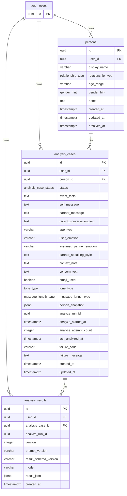

# DB設計書

## 1. このDB設計の目的

このDB設計の目的は、相手の機嫌・感情分析アプリの業務データをPostgreSQLに永続化し、過去の相談内容・人物情報・分析結果をAIに渡せる状態にすることです。

認証は Supabase Auth に任せます。アプリ側DBでは、認証・ログイン・セッション管理・パスワード管理・refresh token管理を自前実装しません。

旧仕様の `sessionId` ベース識別は捨てます。`sessionId` はゲスト識別用の仮の札であり、ユーザー本人性・複数端末利用・長期的な所有権管理には向きません。

旧仕様の localStorage 業務データ保存も捨てます。相談本文、人物メモ、分析結果をブラウザ保存にすると、端末依存・紛失・漏えい・複数端末同期不能・AI文脈再利用不能の問題が起きます。業務データの正本はDBです。

## 2. 設計方針

- 認証基盤は Supabase Auth とする。
- アプリ側では自前認証を作らない。
- アプリ側データの所有者IDは Supabase Auth の `auth.users.id` を正とする。
- アプリ側の各業務テーブルは `user_id uuid not null references auth.users(id) on delete cascade` を持つ。
- クライアントから `user_id` を送らせない。バックエンドまたはRLSがSupabase Authの認証済みユーザーから特定する。
- 他人のリソースIDを指定された場合は、存在有無を隠すため `404 RESOURCE_NOT_FOUND` として扱う。
- 業務データを localStorage に保存しない。
- `AnalysisCase` は `draft / analyzing / analyzed / failed` で状態管理する。
- `AnalysisResult` は履歴保存する。`AnalysisCase 1:N AnalysisResult` とする。
- 最新結果は `version DESC` で取得する。
- `created_at` は表示・監査用であり、最新判定の正本にはしない。
- `AnalysisCase` と `AnalysisResult` の循環参照は作らない。
- `AnalysisCase` は最新結果IDを持たない。
- 他AIとの差別化のため、単に相談履歴を保存するだけでなく、分析後のユーザーフィードバックと人物ごとの傾向要約を保存できる設計にする。
- AI分析結果は絶対的な診断として扱わず、「根拠」「別解釈」「悪く見すぎない理由」「次の安全な行動」を提示するための材料として保存する。
- 将来的に過去相談をAIへ渡す場合でも、毎回すべての相談本文を渡すのではなく、必要に応じて要約済みの人物傾向を使う。
- ユーザー自身の不安傾向を扱う場合は、心理診断ではなく、入力履歴から見える利用上の傾向として扱う。

## 3. Supabase Auth採用により不要なもの

以下は Supabase Auth 採用により、アプリ側DB・アプリ側APIでは作りません。

- 自前 users テーブル
- auth_sessions テーブル
- password_hash カラム
- refresh_token_hash カラム
- refreshToken ローテーションSQL
- HMAC-SHA256によるrefreshToken保存
- bcrypt / Argon2idによる自前パスワード保存
- logout時の revoked_at 管理
- `/api/auth/register`
- `/api/auth/login`
- `/api/auth/refresh`
- `/api/auth/logout`
- JWTの自前発行処理

認証・ログイン・セッション管理・パスワード管理・refreshToken管理は Supabase Auth に任せます。

## 4. 差別化方針とDB設計の対応

KIGEN404は、単なるAI感情分析アプリではなく、人間関係の不安を履歴・根拠・振り返りで整理するアプリとして設計します。差別化方針とDB・AI出力・UIの対応は次の通りです。

| 差別化方針 | 意味 | DBでの対応 | AI出力での対応 | UIでの対応 |
| --- | --- | --- | --- | --- |
| 人物ごとの関係性メモリを作る | 相手ごとに過去相談、普段の返信傾向、関係性メモを持つ | `persons`, `analysis_cases`, `analysis_results`, 実装計画の `person_profiles` | 過去相談や人物メモを踏まえた文脈情報を扱う | Personごとの履歴・傾向を見られる画面 |
| いつもの傾向と今回の異常を分ける | 過去の相談履歴やPersonごとの傾向と今回の相談内容を比較する | `analysis_cases`, `analysis_results`, 実装計画の `person_profiles` | 「普段と同じ可能性」「今回だけ違う可能性」を分ける | 通常傾向と今回の差分を表示 |
| AIの結論ではなく判断根拠を見せる | スコアだけでなく、理由・別解釈・避ける行動・安全な行動を出す | `analysis_results.result_json` | `reasons`, `avoidExpressions`, `actions`, `goodSignals`, 別解釈を保存 | 根拠カード、別解釈、次の行動を表示 |
| 返信文生成よりも認知の偏りを整える | 短文・絵文字なし・返信時間などを悪く解釈しすぎていないか整理する | `analysis_results.result_json`, 実装計画の `analysis_feedbacks`, `user_pattern_summaries` | 悪く見すぎない理由、ユーザーの受け取り方の傾向を扱う | 不安の整理、見方の切り替え、振り返りUI |
| 人間関係のOSにする | 相談、AI分析、根拠確認、行動、振り返り、次回への反映までつなげる | `persons`, `analysis_cases`, `analysis_results`, 実装計画の `analysis_feedbacks`, `person_profiles`, `user_pattern_summaries` | 分析結果と振り返りを次回の文脈に使う | 履歴、行動メモ、フィードバック、次回への反映 |

`analysis_results.result_json` は、単なる感情スコアだけでなく、判断根拠・別解釈・悪く見すぎない理由・安全な行動提案を保存するための中心です。ただし、AI出力は心理診断ではなく、相談入力と履歴から見える可能性・解釈・行動案として扱います。

## 5. ER概要

- `auth.users 1:N persons`: 1人のSupabase Authユーザーは複数の分析対象人物を持つ。
- `auth.users 1:N analysis_cases`: 1人のSupabase Authユーザーは複数の相談ケースを持つ。
- `auth.users 1:N analysis_results`: 1人のSupabase Authユーザーは複数のAI分析結果を持つ。
- `persons 1:N analysis_cases`: 1人の分析対象人物には複数の相談ケースを紐づけられる。
- `analysis_cases 1:N analysis_results`: 1つの相談ケースは複数の分析結果履歴を持てる。



`auth_users` はMermaid上の表記です。実DBでは Supabase Auth の `auth.users` を参照します。

## 6. テーブル一覧

### persons

- 役割: 分析対象の相手を表す。
- 主なカラム: `id`, `user_id`, `display_name`, `relationship_type`, `age_range`, `gender_hint`, `notes`, `created_at`, `updated_at`, `archived_at`
- 主キー: `id`
- 外部キー: `user_id` -> `auth.users(id)`
- 一意制約: `(user_id, id)`
- CHECK制約: `display_name`, `age_range`, `notes` の長さ制約をSQL migrationで持つ想定。
- index: `(user_id, updated_at)`, `(user_id, archived_at)`
- 削除方針: `auth.users` 削除時は `on delete cascade` で削除される。人物非表示は `archived_at` によるアーカイブを使う。
- 注意点: `Person` 更新後も過去の `AnalysisCase.person_snapshot` は書き換えない。

### analysis_cases

- 役割: 1回分の相談入力を表す。AI分析の状態管理も担う。
- 主なカラム: `id`, `user_id`, `person_id`, `status`, 入力本文群, `person_snapshot`, `analyze_run_id`, `analyze_started_at`, `analyze_attempt_count`, `last_analyzed_at`, `failure_code`, `failure_message`, `created_at`, `updated_at`
- 主キー: `id`
- 外部キー: `user_id` -> `auth.users(id)`, `(user_id, person_id)` -> `persons(user_id, id)`
- 一意制約: `(user_id, id)`
- CHECK制約: 必須テキストの空白のみ拒否、任意テキストの空白のみ拒否、`person_snapshot` の最低構造、`analyze_attempt_count >= 0`, `status='analyzing'` 時の `analyze_run_id` と `analyze_started_at` 必須。
- index: `(user_id, created_at)`, `(user_id, person_id, created_at)`, `(user_id, person_id, status, created_at)`, `(user_id, status)`, stale検出用partial index。
- 削除方針: `auth.users` 削除時は `on delete cascade` で削除される。ケース削除APIは現時点でスコープ外。
- 注意点: 最新結果IDは持たない。最新結果は `analysis_results` を `version DESC` で取得する。

### analysis_results

- 役割: AIが返した分析結果を履歴として保存する。
- 主なカラム: `id`, `user_id`, `analysis_case_id`, `analyze_run_id`, `version`, `prompt_version`, `result_schema_version`, `model`, `result_json`, `created_at`
- 主キー: `id`
- 外部キー: `user_id` -> `auth.users(id)`, `(user_id, analysis_case_id)` -> `analysis_cases(user_id, id)`
- 一意制約: `(analysis_case_id, version)`, `(analysis_case_id, analyze_run_id)`
- CHECK制約: `version >= 1`, `prompt_version`, `result_schema_version`, `model` の空文字拒否、`result_json` のobjectチェック。
- index: `(user_id, analysis_case_id, version DESC)` をSQL migrationで作成する。
- 削除方針: `auth.users` または `analysis_cases` に従属。通常は履歴として保持する。
- 注意点: `created_at` は表示・監査用。最新判定は `version` を正本にする。

## 7. 共通所有者カラム

アプリ側の業務テーブルは、原則として次のカラムを持ちます。

```sql
user_id uuid not null references auth.users(id) on delete cascade
```

この `user_id` は Supabase Auth の `auth.users.id` です。アプリ独自のユーザーIDではありません。

すべての取得・更新・削除では、認証済みユーザーの `auth.users.id` を `user_id` 条件に含めます。クライアントから送られた `user_id` は信用しません。

## 8. persons

`persons` は分析対象の相手です。

| カラム | 型 | 必須 | 説明 |
| --- | --- | --- | --- |
| `id` | `uuid` | yes | 人物ID。主キー。 |
| `user_id` | `uuid` | yes | 所有ユーザー。`auth.users(id)` を参照。 |
| `display_name` | `varchar(50)` | yes | 相手の表示名。 |
| `relationship_type` | `relationship_type` | yes | 関係性。 |
| `age_range` | `varchar(20)` | no | 年代ヒント。 |
| `gender_hint` | `gender_hint` | no | 性別ヒント。 |
| `notes` | `text` | no | 相手に関する補足。 |
| `created_at` | `timestamptz` | yes | 作成日時。 |
| `updated_at` | `timestamptz` | yes | 更新日時。DBトリガーで更新する。 |
| `archived_at` | `timestamptz` | no | 論理アーカイブ日時。 |

関係:

- `auth.users 1:N persons`
- `persons 1:N analysis_cases`
- `analysis_cases` は `(user_id, person_id)` で `persons(user_id, id)` を参照し、DBレベルでも所有権不整合を防ぐ。

`archived_at` の扱い:

- `Person` の削除APIは現時点でスコープ外。
- 一覧取得では `archived_at IS NULL` を基本とする。
- 過去の `analysis_cases.person_snapshot` は `Person` を更新・アーカイブしても書き換えない。

## 9. analysis_cases

`analysis_cases` は1回分の相談入力と分析状態の正本です。

| カラム | 型 | 必須 | 説明 |
| --- | --- | --- | --- |
| `id` | `uuid` | yes | ケースID。主キー。 |
| `user_id` | `uuid` | yes | 所有ユーザー。`auth.users(id)` を参照。 |
| `person_id` | `uuid` | yes | 対象人物。 |
| `status` | `analysis_case_status` | yes | `draft / analyzing / analyzed / failed`。 |
| `event_facts` | `text` | yes | 実際に何が起きたか。 |
| `self_message` | `text` | yes | 自分が送った文。 |
| `partner_message` | `text` | yes | 相手が返した文。 |
| `recent_conversation_text` | `text` | no | 直前の会話。 |
| `app_type` | `varchar(50)` | no | LINE / Slack / DMなど。 |
| `user_emotion` | `varchar(100)` | no | 相談者の感情。 |
| `assumed_partner_emotion` | `varchar(100)` | no | ユーザーが予想する相手の感情。 |
| `partner_speaking_style` | `text` | no | 相手の普段の話し方。 |
| `context_note` | `text` | no | 背景事情。 |
| `concern_text` | `text` | no | 不安点。 |
| `emoji_used` | `boolean` | no | 絵文字の有無。 |
| `tone_type` | `tone_type` | no | `formal / casual / mixed / unknown`。 |
| `message_length_type` | `message_length_type` | no | `short / normal / long / unknown`。 |
| `person_snapshot` | `jsonb` | yes | ケース作成時点のPerson情報。 |
| `analyze_run_id` | `uuid` | no | 現在実行中の分析を識別するUUID。 |
| `analyze_started_at` | `timestamptz` | no | 現在の分析開始時刻。 |
| `analyze_attempt_count` | `integer` | yes | 分析開始を試みた回数。 |
| `last_analyzed_at` | `timestamptz` | no | 最終分析完了時刻。 |
| `failure_code` | `varchar(100)` | no | 最終失敗コード。 |
| `failure_message` | `text` | no | 最終失敗内容。 |
| `created_at` | `timestamptz` | yes | 作成日時。 |
| `updated_at` | `timestamptz` | yes | 更新日時。DBトリガーで更新する。 |

状態:

- `status` は `draft / analyzing / analyzed / failed`。
- 編集可能なのは `draft / failed` のみ。
- `analyzing` のとき `analyze_run_id` と `analyze_started_at` は必須。
- `analyze_attempt_count` は0以上。

`person_snapshot`:

- `schemaVersion` を必須で含める。
- `capturedAt` を必須で含める。
- `person` を必須で含める。
- `person.displayName`, `person.relationshipType`, `person.ageRange`, `person.genderHint`, `person.notes` を含める。
- 過去ケースの文脈を壊さないために保存する。
- `Person` 更新後も過去ケースの `person_snapshot` は書き換えない。

明示的に存在しないもの:

- 最新結果IDカラムは作らない。

主な制約:

```sql
CONSTRAINT analysis_cases_analyzing_has_run_info
  CHECK (
    status <> 'analyzing'
    OR (
      analyze_run_id IS NOT NULL
      AND analyze_started_at IS NOT NULL
    )
  )
```

```sql
CONSTRAINT analysis_cases_attempt_count_non_negative
  CHECK (analyze_attempt_count >= 0)
```

```sql
CONSTRAINT analysis_cases_person_snapshot_shape
  CHECK (
    jsonb_typeof(person_snapshot) = 'object'
    AND person_snapshot ? 'schemaVersion'
    AND person_snapshot ? 'capturedAt'
    AND person_snapshot ? 'person'
    AND jsonb_typeof(person_snapshot -> 'person') = 'object'
  )
```

必須テキストは空白のみを拒否する。任意テキストはアプリ層で空文字・空白のみを `null` に正規化し、DB側でも空白のみを拒否する。

## 10. analysis_results

`analysis_results` はAI分析結果の履歴です。

| カラム | 型 | 必須 | 説明 |
| --- | --- | --- | --- |
| `id` | `uuid` | yes | 結果ID。主キー。 |
| `user_id` | `uuid` | yes | 所有ユーザー。`auth.users(id)` を参照。 |
| `analysis_case_id` | `uuid` | yes | 対象ケース。 |
| `analyze_run_id` | `uuid` | yes | この結果を生成した分析実行ID。 |
| `version` | `integer` | yes | ケース内の結果バージョン。 |
| `prompt_version` | `varchar(50)` | yes | 使用プロンプト版。 |
| `result_schema_version` | `varchar(50)` | yes | AI出力JSON構造のバージョン。 |
| `model` | `varchar(100)` | yes | 利用モデル名。 |
| `result_json` | `jsonb` | yes | AI構造化出力全文。 |
| `created_at` | `timestamptz` | yes | 作成日時。表示・監査用。 |

関係と制約:

- `analysis_cases 1:N analysis_results`
- `UNIQUE (analysis_case_id, version)`
- `UNIQUE (analysis_case_id, analyze_run_id)`
- `version >= 1`
- `prompt_version`, `result_schema_version`, `model` は空文字不可。
- `result_json` はAI構造化出力全文。感情スコアだけでなく、判断根拠、別解釈、悪く見すぎない理由、避けるべき行動、次に取る安全な行動も保存対象にする。
- `result_schema_version` はAI出力JSON構造のバージョン。
- 最新結果は `version DESC` で取得する。
- `created_at` は表示・監査用であり、最新判定の正本ではない。

## 11. 最新結果取得

最新結果は `version` を正本順序として取得します。

```sql
SELECT *
FROM analysis_results
WHERE user_id = $1
  AND analysis_case_id = $2
ORDER BY version DESC
LIMIT 1;
```

最新結果取得用index:

```sql
CREATE INDEX analysis_results_latest_lookup_idx
  ON analysis_results(user_id, analysis_case_id, version DESC);
```

## 12. 過去相談履歴の取得方針

ユーザーは、自分が作成した過去の相談内容を閲覧できます。

閲覧できる単位:

- 自分の相談ケース一覧
- 特定のPersonに紐づく相談ケース一覧
- 特定のAnalysisCase詳細
- 特定のAnalysisCaseの最新AnalysisResult
- 必要に応じて、同一AnalysisCaseのAnalysisResult履歴

すべての取得処理では、必ずSupabase Authの認証済みユーザーID、つまり `auth.users.id` を `user_id` 条件に含めます。

他人の personId, caseId, resultId が指定された場合は、存在有無を隠すため 404 RESOURCE_NOT_FOUND を返します。

## 13. 分析開始・成功・失敗フロー

分析開始:

- 分析開始は `status IN ('draft', 'failed')` の条件付きUPDATEで行う。
- `analyze_run_id` はDB側で発行する。
- `analyze_attempt_count` を加算する。
- `RETURNING` が0件の場合は、存在しない、他人のケース、または開始不可状態として扱う。

```sql
UPDATE analysis_cases
SET
  status = 'analyzing',
  analyze_run_id = gen_random_uuid(),
  analyze_started_at = now(),
  analyze_attempt_count = analyze_attempt_count + 1,
  failure_code = NULL,
  failure_message = NULL
WHERE user_id = :userId
  AND id = :caseId
  AND status IN ('draft', 'failed')
RETURNING id, user_id, analyze_run_id;
```

分析成功:

- 成功時は `analyze_run_id` が一致し、ケース完了UPDATEが成功した場合だけ `AnalysisResult` をINSERTする。
- INSERTが0件なら必ずROLLBACKする。
- `version` は同一トランザクション内で `MAX(version) + 1` により採番する。
- 古いAI実行が後から戻ってきても現在状態を上書きしない。

```sql
WITH updated_case AS (
  UPDATE analysis_cases
  SET
    status = 'analyzed',
    last_analyzed_at = now(),
    failure_code = NULL,
    failure_message = NULL
  WHERE user_id = :userId
    AND id = :caseId
    AND status = 'analyzing'
    AND analyze_run_id = :analyzeRunId
  RETURNING id, user_id, analyze_run_id
),
next_version AS (
  SELECT COALESCE(MAX(ar.version), 0) + 1 AS version
  FROM analysis_results ar
  JOIN updated_case uc ON uc.id = ar.analysis_case_id
)
INSERT INTO analysis_results (
  user_id,
  analysis_case_id,
  analyze_run_id,
  version,
  prompt_version,
  result_schema_version,
  model,
  result_json
)
SELECT
  uc.user_id,
  uc.id,
  uc.analyze_run_id,
  nv.version,
  :promptVersion,
  :resultSchemaVersion,
  :model,
  :resultJson
FROM updated_case uc
CROSS JOIN next_version nv
RETURNING id, version;
```

分析失敗:

- 失敗時UPDATEが0件なら古い実行として無視する。
- 古いAI実行が後から戻ってきても現在状態を上書きしない。

```sql
UPDATE analysis_cases
SET
  status = 'failed',
  failure_code = :failureCode,
  failure_message = :failureMessage
WHERE user_id = :userId
  AND id = :caseId
  AND status = 'analyzing'
  AND analyze_run_id = :analyzeRunId;
```

## 14. stale analyzing 復旧

同期実行でも、サーバーダウン、プロセス停止、AI呼び出し途中停止により `analyzing` のまま残る可能性があります。運用SQLまたは定期処理でstaleな `analyzing` を `failed` に戻します。

partial index:

```sql
CREATE INDEX analysis_cases_stale_analyzing_idx
  ON analysis_cases(analyze_started_at)
  WHERE status = 'analyzing';
```

復旧SQL:

```sql
UPDATE analysis_cases
SET
  status = 'failed',
  failure_code = 'ANALYSIS_STALE',
  failure_message = '分析処理が途中で停止した可能性があります'
WHERE status = 'analyzing'
  AND analyze_started_at IS NOT NULL
  AND analyze_started_at < now() - interval '5 minutes';
```

## 15. Prisma schema と SQL migration の責務分担

Prisma schemaで表現するもの:

- model
- field
- enum
- relation
- primary key
- foreign key
- unique
- 基本index
- Prisma Clientで扱う型

SQL migrationで表現するもの:

- `CREATE EXTENSION`
- `auth.users(id)` への外部キー
- `CHECK` 制約
- `updated_at` trigger
- partial index
- DESC付きindex
- stale analyzing 復旧SQL
- 分析成功時のCTE SQL
- Supabase RLS policy

運用ルール:

- PostgreSQL固有の制約・trigger・partial index・DESC index・RLS policyはSQL migrationを正とする。
- `schema.prisma` はPrisma Client用の型・relationの正本とする。
- DB固有制約は migration SQL を正本とする。
- `prisma db push` を本番相当環境で使わない。
- migration SQLはレビュー対象にする。
- SQL migrationに書いた制約を、Prisma schemaだけで勝手に消さない。
- Prisma schema と SQL migration の差分が出た場合は、仕様書を先に更新してから修正する。

## 16. localStorage / sessionStorage 方針

localStorageに保存してよいもの:

- `theme`
- `sidebarCollapsed`
- `locale`
- 初回チュートリアルの既読フラグ

localStorageに保存してはいけないもの:

- Supabaseセッション情報を独自形式で保存したもの
- `Person.notes`
- `eventFacts`
- `selfMessage`
- `partnerMessage`
- `AnalysisResult`
- 相談本文
- 人物メモ
- 分析結果

認証情報:

- 認証状態はSupabase AuthのSDKが管理する。
- アプリ独自にaccess token / refresh tokenを発行・保存しない。
- refresh tokenをアプリDBに保存しない。

sessionStorage:

- 未送信フォームの一時下書きを保存する場合だけ使用してよい。
- 下書き保存機能は現時点で未確定。
- 下書き保存を入れる場合は、保存対象と削除タイミングを別途仕様化する。

## 17. セキュリティ上の注意

- パスワード管理は Supabase Auth に任せる。
- アプリDBにパスワードを保存しない。
- refresh token管理は Supabase Auth に任せる。
- アプリDBにrefresh tokenを保存しない。
- CORSの許可Originはallowlistで制御する。
- CookieやAuthorization headerを使うAPIではOrigin検証を行う。
- すべての保護APIで `auth.users.id` による所有権検証を行う。
- 他人のリソースIDを指定された場合は `404 RESOURCE_NOT_FOUND` を返す。
- ログに本文全文・APIキー・パスワード相当の秘密情報を出さない。
- 本番公開前はセキュリティ・個人情報・利用規約について専門家確認が必要。

## 18. 差別化機能の実装計画

KIGEN404を単なるAI感情分析アプリではなく、人間関係の不安を履歴・根拠・振り返りで整理するアプリにするため、以下の3テーブルを実装計画に含める。

- `analysis_feedbacks`
- `person_profiles`
- `user_pattern_summaries`

これらはファインチューニングやローカルLLMを前提にしたものではない。

初期段階では、外部LLM API、DBに保存した履歴、プロンプト改善、必要な文脈だけをAIに渡すRAG的な設計で実現する。

`analysis_feedbacks` は、初期段階ではAIモデルの教師データではなく、プロダクト改善、プロンプト改善、人物傾向要約のための参考データとして扱う。

将来的にファインチューニングや学習データとして利用する場合は、ユーザーの明示的同意、匿名化、削除対応、データ品質基準を別途定める。

### 18-1. analysis_feedbacks

実装優先度: 高  
実装段階: 短期実装対象

`analysis_feedbacks` は、AI分析結果に対するユーザー評価と、実際にその後どうなったかを保存するテーブルである。

このテーブルを追加する理由は、AIの回答を出して終わりにせず、「その分析が役に立ったか」「実際の結果とズレていたか」を後から確認し、プロダクト改善やプロンプト改善に活かすためである。

主なカラム候補:

| カラム | 型 | 必須 | 説明 |
| --- | --- | --- | --- |
| `id` | `uuid` | yes | フィードバックID。主キー。 |
| `user_id` | `uuid` | yes | 所有ユーザー。`auth.users(id)` を参照。 |
| `analysis_case_id` | `uuid` | yes | 対象ケース。 |
| `analysis_result_id` | `uuid` | yes | 評価対象のAI分析結果。 |
| `was_helpful` | `boolean` | no | 分析が役に立ったか。 |
| `outcome_type` | `varchar(50)` | no | 実際の結果分類。 |
| `actual_outcome_note` | `text` | no | 実際にどうなったかのメモ。 |
| `user_correction` | `text` | no | ユーザーによる補足・訂正。 |
| `created_at` | `timestamptz` | yes | 作成日時。 |
| `updated_at` | `timestamptz` | yes | 更新日時。DBトリガーで更新する。 |

`outcome_type` の候補:

- `not_checked`
- `seemed_correct`
- `seemed_wrong`
- `relationship_improved`
- `relationship_unchanged`
- `relationship_worsened`
- `unknown`

関係と制約:

- `analysis_results 1:0..1 analysis_feedbacks`
- `UNIQUE (analysis_result_id)`
- `user_id` は `auth.users(id)` を参照する
- `(user_id, analysis_case_id)` は `analysis_cases(user_id, id)` を参照する
- `(user_id, analysis_result_id)` は `analysis_results(user_id, id)` を参照する
- 取得・更新時は必ず `user_id` 条件を含める

注意点:

- `analysis_feedbacks` は初期段階ではファインチューニング用の教師データではない。
- ユーザーの主観が含まれるため、絶対的な正解ラベルとして扱わない。
- プロダクト改善、プロンプト改善、人物傾向要約の参考データとして扱う。

### 18-2. person_profiles

実装優先度: 高  
実装段階: 中期実装対象

`person_profiles` は、Personごとの普段の傾向をAIに渡しやすい要約として保存するテーブルである。

このテーブルを追加する理由は、毎回すべての過去相談本文をAIに渡すと、コスト・速度・プライバシー面の負担が大きくなるためである。過去相談から「普段の返信傾向」「悪く見すぎなくてよい根拠」「いつもと違う可能性がある条件」などを要約して保存する。

主なカラム候補:

| カラム | 型 | 必須 | 説明 |
| --- | --- | --- | --- |
| `id` | `uuid` | yes | 人物傾向要約ID。主キー。 |
| `user_id` | `uuid` | yes | 所有ユーザー。`auth.users(id)` を参照。 |
| `person_id` | `uuid` | yes | 対象Person。 |
| `profile_schema_version` | `varchar(50)` | yes | `profile_json` の構造バージョン。 |
| `profile_json` | `jsonb` | yes | Personごとの傾向要約。 |
| `source_case_count` | `integer` | yes | 要約生成に使ったケース数。 |
| `last_generated_at` | `timestamptz` | no | 最終生成日時。 |
| `created_at` | `timestamptz` | yes | 作成日時。 |
| `updated_at` | `timestamptz` | yes | 更新日時。DBトリガーで更新する。 |

`profile_json` の例:

```json
{
  "usualReplyStyle": {
    "messageLength": "short",
    "tone": "casual",
    "emojiUsage": "low"
  },
  "commonPatterns": [
    "普段から短文で返信することが多い",
    "忙しい時期は返信が遅くなりやすい"
  ],
  "badInterpretationWarnings": [
    "短文だけで怒っていると判断しない方がよい"
  ],
  "usefulContextForPrompt": [
    "過去にも短文返信があったが、その後の関係悪化は確認されていない"
  ],
  "confidence": "low"
}
```

関係と制約:

- `persons 1:0..1 person_profiles`
- `UNIQUE (person_id)`
- `user_id` は `auth.users(id)` を参照する
- `(user_id, person_id)` は `persons(user_id, id)` を参照する
- `source_case_count >= 0`
- `profile_schema_version` は空文字不可
- `profile_json` はobjectであること
- 取得・更新時は必ず `user_id` 条件を含める

注意点:

- `persons.notes` はユーザーが直接書くメモである。
- `person_profiles.profile_json` は、システムが生成・更新するAI用の傾向要約である。
- `Person` 更新時に必ず再生成する必要はない。
- 再生成タイミング、再生成条件、要約に使うケース範囲は別途仕様化する。

### 18-3. user_pattern_summaries

実装優先度: 中  
実装段階: 中長期実装対象

`user_pattern_summaries` は、ユーザー自身がどのような場面で不安になりやすいかを要約して保存するテーブルである。

このテーブルを追加する理由は、KIGEN404を「相手の機嫌を当てるAI」ではなく、「自分の考えすぎや不安を整理するAI」に近づけるためである。

主なカラム候補:

| カラム | 型 | 必須 | 説明 |
| --- | --- | --- | --- |
| `id` | `uuid` | yes | ユーザー傾向要約ID。主キー。 |
| `user_id` | `uuid` | yes | 所有ユーザー。`auth.users(id)` を参照。 |
| `summary_schema_version` | `varchar(50)` | yes | `summary_json` の構造バージョン。 |
| `summary_json` | `jsonb` | yes | ユーザー自身の不安傾向要約。 |
| `source_case_count` | `integer` | yes | 要約生成に使ったケース数。 |
| `last_generated_at` | `timestamptz` | no | 最終生成日時。 |
| `created_at` | `timestamptz` | yes | 作成日時。 |
| `updated_at` | `timestamptz` | yes | 更新日時。DBトリガーで更新する。 |

`summary_json` の例:

```json
{
  "frequentAnxietyTriggers": [
    "返信が短い",
    "絵文字がない",
    "既読後に時間が空く"
  ],
  "overInterpretationPatterns": [
    "短文返信を拒絶と解釈しやすい"
  ],
  "helpfulActions": [
    "すぐに追撃せず、数時間待つ",
    "相手の忙しさを確認してから返信する"
  ],
  "monthlySummary": {
    "totalCases": 9,
    "casesLaterMarkedAsWorse": 1
  },
  "confidence": "low"
}
```

関係と制約:

- `auth.users 1:0..1 user_pattern_summaries`
- `UNIQUE (user_id)`
- `user_id` は `auth.users(id)` を参照する
- `source_case_count >= 0`
- `summary_schema_version` は空文字不可
- `summary_json` はobjectであること

注意点:

- この要約は心理診断ではない。
- 「あなたは〇〇障害です」のような診断風表現に使ってはいけない。
- UIでは「利用履歴から見える傾向」として表示する。
- 本番公開前に、表現・利用規約・プライバシーポリシーについて専門家確認が必要。

### 18-4. 実装順序

第1段階:  
`analysis_results.result_json` の構造を見直し、AIの結論だけでなく、判断根拠・悪く見すぎなくてよい理由・避けるべき行動・次の安全な行動を保存できるようにする。

第2段階:  
`analysis_feedbacks` を実装し、AI分析が役に立ったか、実際にその後どうなったかを保存できるようにする。

第3段階:  
`person_profiles` を実装し、Personごとの普段の傾向を要約して、次回以降の分析に使えるようにする。

第4段階:  
`person_profiles` と今回の `analysis_case` を比較し、「いつもの範囲」「いつもと違う可能性」を `analysis_results.result_json` に保存する。

第5段階:  
`user_pattern_summaries` を実装し、ユーザー自身が不安になりやすい条件を、心理診断ではなく利用履歴上の傾向として整理する。

### 18-5. その他の拡張検討

`analysis_jobs` は、AI分析を非同期ジョブ化する場合のジョブ管理テーブルです。現時点では同期実行なので作りません。

`audit_logs` は、認証以外の重要操作・管理操作の監査ログです。本番運用や管理画面を入れる段階で検討します。Supabase Auth側の認証ログとは分けて考えます。

## 19. 実装時チェックリスト

- [ ] アプリ側に自前 users テーブルを作っていない
- [ ] アプリ側に auth_sessions テーブルを作っていない
- [ ] アプリ側に password_hash / refresh_token_hash を作っていない
- [ ] 自前のJWT発行処理を作っていない
- [ ] `/api/auth/register`, `/api/auth/login`, `/api/auth/refresh`, `/api/auth/logout` をアプリ側で作っていない
- [ ] 業務テーブルの `user_id` が `auth.users(id)` を参照している
- [ ] 最新結果取得が `version DESC`
- [ ] `created_at DESC` を最新判定に使っていない
- [ ] `analyze_run_id` が `analysis_cases` と `analysis_results` にある
- [ ] stale復旧SQLがある
- [ ] `updated_at` triggerがある
- [ ] Prisma schemaとSQL migrationの責務分担が明記されている

作業後に実行する確認コマンド:

```bash
rg "auth_sessions|password_hash|refresh_token_hash|refreshToken ローテーション|HMAC-SHA256|bcrypt|Argon2|revoked_at|JWT_ACCESS_SECRET|JWT_REFRESH_SECRET" docs/database-design.md
rg "auth.users\\(id\\)|auth.users.id|references auth.users" docs/database-design.md
rg "ORDER BY version DESC|version DESC" docs/database-design.md
rg "ORDER BY created_at|created_at DESC" docs/database-design.md
```

## 未解決・確認事項

- Supabase AuthのセッションをフロントでどのSDK設定で保持するかは、フロント実装時に確認する。
- Supabase RLSを必須にするか、バックエンドAPIの所有権検証を主にするか、または両方使うかは実装前に確定する。
- `analysis_feedbacks` のフィードバックUIをどの画面に置くかは未確定。
- `analysis_feedbacks.outcome_type` の候補値は、実装前にUI文言と合わせて最終確認する。
- `person_profiles` の再生成タイミングは未確定。
- `person_profiles` をAI生成するか、ルールベースで一部生成するかは未確定。
- `person_profiles` の要約に使う相談履歴の範囲は未確定。
- `user_pattern_summaries` の表示文言は、心理診断に見えないように慎重に設計する。
- `user_pattern_summaries` をUIに表示する前に、利用規約・プライバシーポリシー上の扱いを確認する。
- 下書き保存機能は未確定。
- AI分析の非同期ジョブ化は未確定。
- `relationship_type` などをPostgreSQL ENUMで固定するか、将来の値追加に備えて `varchar + CHECK` にするかは、実装前に最終確認すると安全。
- ユーザー退会時の物理削除・論理削除・削除予約の運用は未確定。
